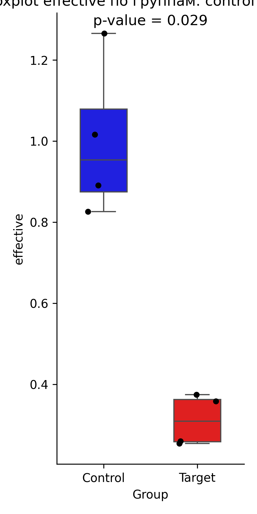

# Отчёт об анализе экспрессии генов Ct GAPDH и Ct PPARg

## 1. Описание данных  
Данные содержат следующие переменные:
- `Sample`: уникальный идентификатор образца, где первые четыре строки относятся к группе `control`, а последние четыре — к группе `target`.
- `Ct GAPDH` и `Ct PPARg`: значения пороговых циклов для двух генов (ген домашнего хозяйства и целевой ген), измеренных для каждого образца.
-  Первые 4 строки — данные контрольных измерений (мыши в нормальных условиях). С 5-ую по 8-ую строки — таргетные данные (мыши в невесомости).

## 2. Предобработка и расчёты  
Для анализа была выполнена следующая последовательность действий:
1. **Вычисление ΔCt**: Для каждого образца была рассчитана разница между значениями `Ct PPARg` и `Ct GAPDH`, обозначенная как `delta_Ct`.
2. **Нормализация ΔCt**: Из получившегося столбца `delta_Ct` был вычтен его минимум, что позволило нормализовать значения (`delta_delta_CT`) и избежать отрицательных результатов.
3. **Расчёт эффективности экспрессии**: Значение эффективности экспрессии для каждого образца (`effective`) было вычислено по формуле:
   [\
   \text{efficiency} = 2^{-\Delta Ct}
   \]
   где `ΔCt` — нормализованные значения, полученные на предыдущем этапе.

## 3. Итоговые данные  
В таблице ниже представлены рассчитанные значения `delta_Ct`, `delta_delta_CT`, и `effective` для каждого образца:

| Sample         | Ct GAPDH   | Ct PPARg   | delta_Ct | delta_delta_CT | effective |
|----------------|------------|------------|----------|----------------|-----------|
| Contr Ad d7 N1 | 20.445820  | 28.221760  | 7.775940 | 0.615679       | 0.826151  |
| Contr Ad d7 N2 | 20.487555  | 27.963959  | 7.476404 | 0.316143       | 1.016784  |
| Contr Ad d7 N3 | 20.628016  | 28.294661  | 7.666645 | 0.506384       | 0.891170  |
| Contr Ad d7 N4 | 20.961941  | 28.122202  | 7.160261 | 0.000000       | 1.265894  |
| V7 Ad d7 N1    | 20.738089  | 30.214193  | 9.476105 | 2.315844       | 0.254249  |
| V7 Ad d7 N2    | 20.328524  | 29.771498  | 9.442974 | 2.282713       | 0.260155  |
| V7 Ad d7 N3    | 20.714630  | 29.692842  | 8.978212 | 1.817951       | 0.359037  |
| V7 Ad d7 N4    | 20.547922  | 29.464903  | 8.916981 | 1.756720       | 0.374604  |

## 4. Статистический анализ  
Для оценки различий в показателях эффективности между группами `control` и `target` был проведён тест Манна-Уитни, который подходит для непараметрических данных и малых выборок. Анализ показал статистически значимое различие между группами знавения с p-value **0.029** < 0.05.

## 5. Построение визуализации  
Для визуального сравнения групп `control` и `target` был построен boxplot, на котором показано распределение значений `effective` для каждой группы.

## Заключение  
Полученные результаты позволяют сделать вывод, что группа `target` статистически значимо отличается от группы `control` по уровню эффективности экспрессии гена (p = 0.029). Таким образом, различия между группами могут свидетельствовать о влиянии экспериментальных условий на экспрессию исследуемого гена.
