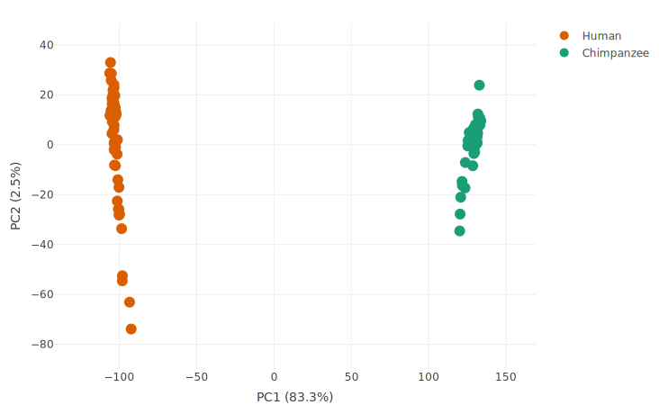
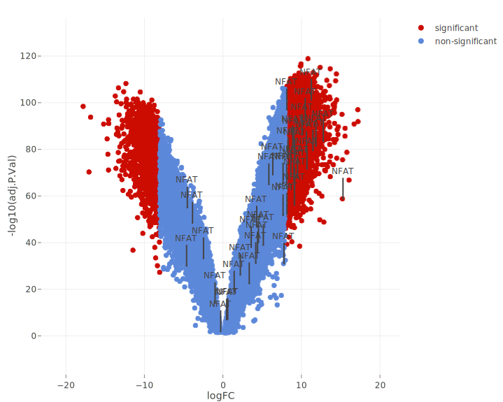
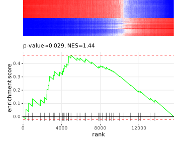
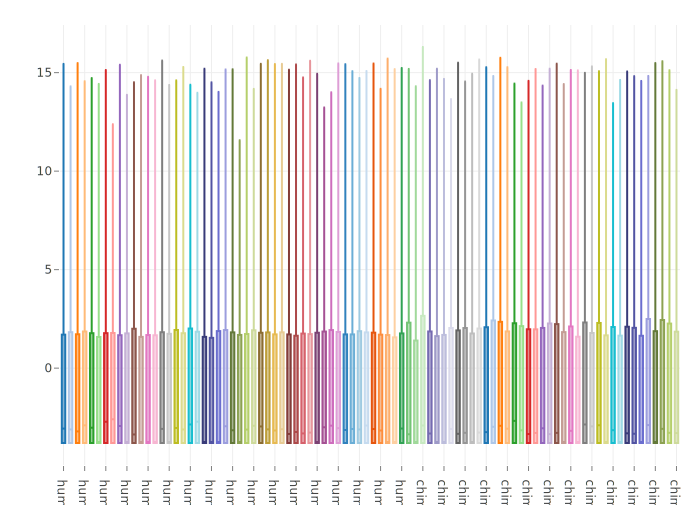
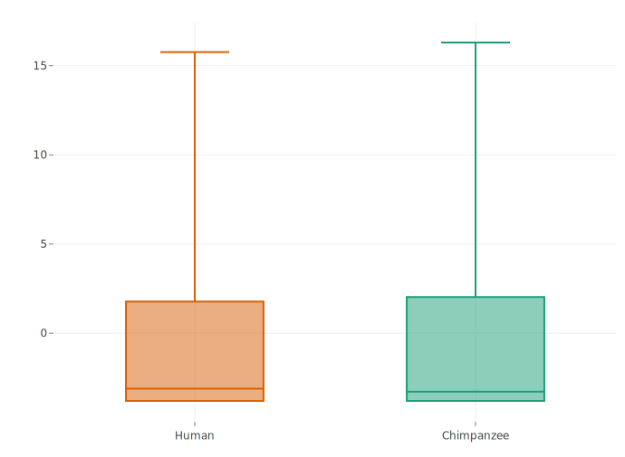
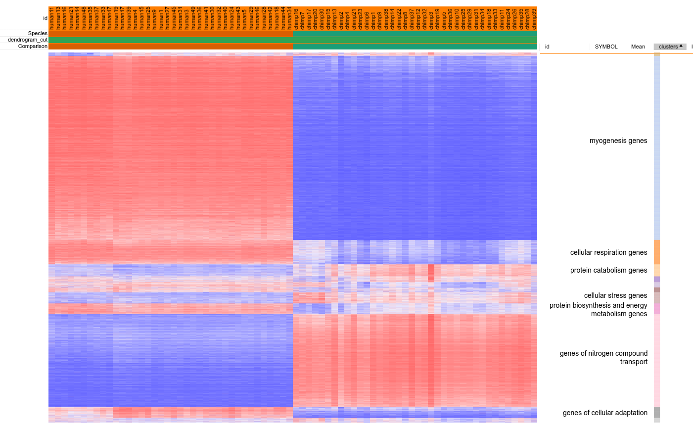

# Changes in the Activity of the NFAT Signaling Pathway in Humans and Chimpanzees

## Abstract
Evolutionary differences between humans and chimpanzees have led to unique adaptations in the cardiovascular system, reflecting distinct physiological needs and lifestyles. The NFAT (Nuclear Factor of Activated T-cells) signaling pathway plays a crucial role in regulating cardiac function, including cardiac hypertrophy, tissue remodeling, and adaptation to mechanical stress [1].

In this study, I analyze changes in the activity of the NFAT signaling pathway in the cardiac tissue of humans and chimpanzees. Using RNA-seq data from the cardiac muscle of both species, I compare the expression of NFAT-related genes to identify potential evolutionary differences in pathway activation. Our results show that humans exhibit increased expression of specific NFAT pathway genes associated with cardiac adaptation to sustained loads and enhanced endurance. This may reflect an evolutionary adaptation to bipedalism and increased lifespan, which require consistent cardiac function.

In chimpanzees, by contrast, the expression of NFAT pathway genes may be associated with adaptation to episodic, high-intensity physical demands typical of their lifestyle. Differences in NFAT pathway activity between the two species underscore the importance of this signaling mechanism in the evolution of the primate cardiovascular system.

## Introduction
Human evolution has been accompanied by significant physiological and genetic changes, especially in the cardiovascular system, which supports endurance, bipedalism, and increased lifespan. One of the key regulators of cardiac function is the NFAT (Nuclear Factor of Activated T-cells) signaling pathway. NFAT is a family of transcription factors that play a crucial role in regulating the expression of genes related to growth, differentiation, and the adaptation of cardiac tissue to mechanical stress and workload.

In cardiac tissue, NFAT is involved in the processes of cardiomyocyte hypertrophy, tissue remodeling, and response to both physiological and pathological stimuli. Increased NFAT activity is associated with the physiological adaptation of the heart to sustained workloads, such as regular physical activity, while chronic activation of NFAT can lead to pathological hypertrophy and heart failure. Understanding the mechanisms of NFAT regulation and activation in the heart is essential for developing new therapeutic approaches for cardiovascular diseases.

Chimpanzees (*Pan troglodytes*), as our closest living relatives, provide a unique opportunity for comparative study of evolutionary changes in cardiac physiology and genetics. Unlike humans, chimpanzees are adapted to a lifestyle that requires episodic and intense physical exertion, such as climbing and jumping, rather than sustained aerobic activities. This may be reflected in differences in the activation of signaling pathways responsible for adapting the heart to workloads, including the NFAT pathway.

Despite close genetic relatedness, small differences in gene regulation can have a significant impact on physiological functions and adaptations. Studying the expression of NFAT pathway genes in the cardiac tissue of humans and chimpanzees may reveal key evolutionary changes that contribute to unique human cardiovascular adaptations, such as increased endurance and capacity for prolonged physical activity.

The aim of this study is to analyze the differential expression of genes related to the NFAT signaling pathway in the cardiac tissue of humans and chimpanzees. Using RNA-seq data, I compare the expression levels of key NFAT pathway components to identify potential evolutionary differences in its activation and regulation. I hypothesize that humans exhibit increased NFAT pathway activity in the heart, reflecting an adaptation to prolonged aerobic workloads and supporting sustained cardiac function.

## Results

This study utilized gene expression data from Jung et al. (2020), where cardiac muscle biopsies were conducted on 39 chimpanzees and 49 humans. After preprocessing and normalization (described in detail in the Materials and Methods section), 38 chimpanzee samples and 39 human samples remained for analysis.

### Principal Component Analysis (PCA)

To assess overall gene expression patterns and data quality, a principal component analysis (PCA) was performed. The PCA results showed clear separation of samples by species, indicating substantial differences in gene expression profiles between human and chimpanzee cardiac tissue (Figure 1). Samples grouped according to their species, confirming the absence of significant technical artifacts and the high quality of the data.

*Figure 1. Principal Component Analysis (PCA) plot showing the clustering of human and chimpanzee cardiac tissue samples based on gene expression profiles.*

### Differential Expression of Genes Related to the NFAT Pathway

A differential expression analysis was conducted to identify genes associated with the NFAT signaling pathway that exhibit significant differences between the two species. Most genes related to NFAT showed substantial differential expression with an absolute log fold change |logFC| > 8 and p-values < 0.05 (Figure 2). These results indicate significant changes in NFAT pathway activity in human cardiac tissue compared to that of chimpanzees.

*Figure 2. Volcano plot showing differential expression of genes associated with the NFAT signaling pathway in human and chimpanzee cardiac tissue.*

### NFAT Pathway Enrichment Analysis

To assess the overall change in NFAT pathway activity, a Gene Set Enrichment Analysis (GSEA) was conducted. Results showed a normalized enrichment score (NES) of 1.44 with a p-value of 0.029, indicating statistically significant enrichment of NFAT pathway genes among differentially expressed genes (Figure 3). This supports the hypothesis of increased NFAT pathway activity in human cardiac tissue.

*Figure 3. Gene Set Enrichment Analysis (GSEA) results for the NFAT signaling pathway in human and chimpanzee cardiac tissue.*

### Interpretation of Results

The findings indicate that humans exhibit increased expression of NFAT pathway-related genes, which may be associated with the adaptation of the heart to sustained aerobic loads and enhanced endurance. In contrast, chimpanzees display lower activity of these genes, consistent with their lifestyle, characterized by episodic, high-intensity physical activity.

## Discussion

Significant differences in NFAT pathway activity between human and chimpanzee cardiac tissue were identified in this study. Differential expression analysis showed that most NFAT-related genes exhibit substantial differential expression, with an absolute log fold change (|logFC|) greater than 8 and p-values < 0.05. This indicates a significantly higher NFAT pathway activity in human cardiac tissue compared to that of chimpanzees.

The GSEA results confirmed these observations: the normalized enrichment score (NES) was 1.44 with a p-value of 0.029, indicating statistically significant enrichment of NFAT pathway genes among the differentially expressed genes in humans. Thus, the data suggest that the NFAT signaling pathway plays a more substantial role in regulating cardiac function in humans, potentially reflecting evolutionary adaptations to sustained aerobic activity[2].

The observed increased NFAT pathway activity in humans may reflect cardiovascular system adaptations to the demands of bipedalism and prolonged physical activity. The human heart must sustain effective function during extended activities, such as walking and running long distances. Elevated expression of NFAT pathway genes may contribute to the development of physiological hypertrophy in cardiomyocytes and enhance the heart's ability to adapt to continuous mechanical loads.

In contrast, chimpanzees, whose lifestyle involves episodic, high-intensity physical efforts such as climbing and jumping, do not require the same degree of cardiac muscle adaptation to prolonged workloads. This may explain the lower NFAT pathway gene activity in their cardiac tissue.

## Materials and Methods

### Data Sources

This study used gene expression data from Jung et al. (2020), "Gene expression variability in human and chimpanzee populations share common determinants"[3]. The raw data, including counts for humans and chimpanzees RNA-seq, are available in the NCBI GEO database under the identifier GSE151397.

### Samples

Cardiac muscle biopsy samples from 49 humans and 39 chimpanzees were analyzed. After preprocessing and exclusion of low-quality samples, 38 human samples and 38 chimpanzee samples remained for further analysis.

### Data Preprocessing

Initially, the authors used the STAR aligner to align RNA-seq sequences. Genome annotation was conducted with GRCh38.p13 for humans and Pan_tro_3.0 from Ensembl release 95 for chimpanzees. Counts of reads were calculated using FeatureCounts.

Only orthologous genes between humans and chimpanzees were selected, using the human ENSEMBL gene notation to ensure gene comparability across species.

### Data Normalization

TMM (Trimmed Mean of M-values) normalization was applied, followed by conversion to CPM (Counts Per Million) and log transformation. These transformations were performed using the edgeR package in the R ([link to script](https://github.com/salimovdr/transcriptomics/blob/main/hw1/TMM_normalization.R)). This approach is appropriate because TMM normalization accounts for differences in library sizes and gene composition across samples, which is particularly important when comparing data from different species[4]. Log transformation stabilizes data variance and improves conditions for subsequent statistical analysis[5].

### Data Analysis

Further analysis was conducted using the Phantasus platform. Samples were annotated by species (human and chimpanzee), and genes were annotated by their identifiers. To assess data distribution, boxplots were generated for each sample, indicating that expression values were evenly distributed after normalization.

*Figure 4. Distribution of counts for each sample and across speices.*

Duplicates and genes with missing values were removed. Subsequently, 16 000 genes with the highest mean expression levels were selected for analysis.

### Principal Component Analysis (PCA) and sample clustering

Principal component analysis (PCA) was performed to visualize the data structure and identify potential outliers. The PCA results showed clear species separation (Figure 1). However, outliers were observed within each species. Sample clustering confirmed the presence of these outliers, which formed separate clusters (Figure 5). It was decided to exclude these samples from further analysis, resulting in 38 human samples and 38 chimpanzee samples.

*Fugure 5. The outliers clustered separately, which is consistent with the data on the PCA plot.*

### Gene Clustering

Gene clustering was performed to identify similar expression patterns. The top 100 genes with the highest expression levels were selected from each cluster. Seven clusters were identified with dominant functional gene groups, allowing for a more detailed analysis of their roles in cardiac tissue (Figure 6).

*Figure 6. Main gene groups identified through clustering.*

### Differential Expression Analysis

Differential gene expression analysis was conducted using the limma model. Genes with an adjusted p-value (p_adj) less than 0.05 were considered statistically significant. A volcano plot (Figure 2) was generated to visualize the results, highlighting genes with significant expression changes (|logFC| > 8 and p < 0.05).

### NFAT Pathway Enrichment Analysis

To assess the relative activity of the NFAT pathway between humans and chimpanzees, a Gene Set Enrichment Analysis (GSEA) was performed. The results showed a normalized enrichment score (NES) of 1.44 with a p-value of 0.029, indicating statistically significant enrichment of NFAT pathway genes among differentially expressed genes (Figure 3).

## References

1. Wang, Hui, Su, Wenhua, Zhang, Shuojie, Wang, Lulin, Zhao, Panpan, Zhang, Tongtong, Xie, Xiaoli, Dan, Juhua, "How does NFAT3 regulate the occurrence of cardiac hypertrophy?" IJC Heart & Vasculature, vol. 48, 2023, p. 101271, ISSN 2352-9067, https://doi.org/10.1016/j.ijcha.2023.101271.
2. Wilkins, B., Dai, Y., Bueno, O., Parsons, S., Xu, J., Plank, D., Jones, F., Kimball, T., & Molkentin, J. (2004). Calcineurin/NFAT Coupling Participates in Pathological, but not Physiological, Cardiac Hypertrophy. Circulation Research: Journal of the American Heart Association, 94, 110-118. https://doi.org/10.1161/01.RES.0000109415.17511.18.
3. Benjamin Jung, Lauren E. Blake, Abhishek Sarkar, Bryan J. Pavlovic, Claudia Cuevas, Yoav Gilad (2020). "Gene expression variability in human and chimpanzee populations share common determinants." *eLife*, 9:e59929. https://doi.org/10.7554/eLife.59929
4. Singh, V., Kirtipal, N., Song, B.-S., Lee, S. (2023). Normalization of RNA-Seq Data using Adaptive Trimmed Mean with Multi-reference. Briefings in Bioinformatics. https://doi.org/10.1093/bib/bbae241
5. Lun, A. (2018). Overcoming systematic errors caused by log-transformation of normalized single-cell RNA sequencing data. bioRxiv, Preprint, 404962. https://doi.org/10.1101/404962

